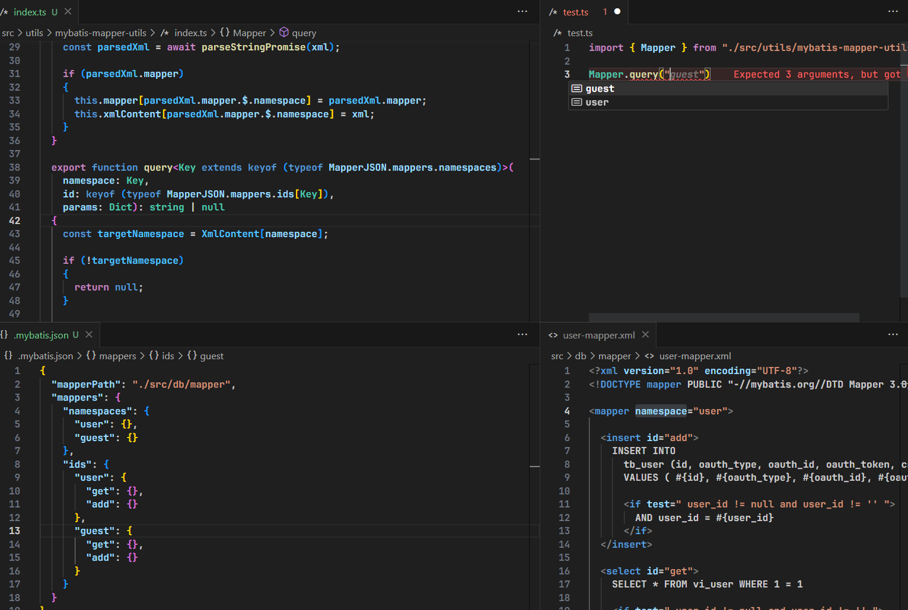
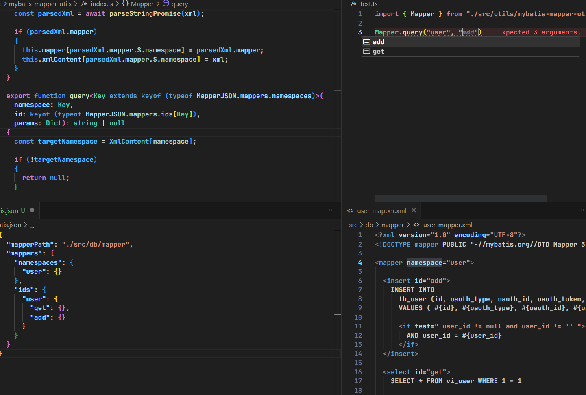

# mybatis-mapper-to-json-namespace

## 1. [UNLICENSE](http://unlicense.org)

[Unlicense](http://unlicense.org) 입니다.

VSCode에서 사용할 수 있는 Extension 입니다.

## 2. 이것은 무엇인가?

Mybatis mapper 파일(XML)을 수정할때마다 `namespace`와 `id`를 관리하는데 어려움을 겪는 나와 같은 외로운 개발자를 위해.

1. Mybatis mapper 파일(XML)를 수정하면,

1. XML의 mapper 태그의 `namespace` 프로퍼티와 

2. Dynamic query(select, update, insert, delete) 태그의 `id` 프로퍼타를 

3. 자동으로 JSON 파일로 작성한다음

4. Mapper를 사용할때마다 `namespace`와 mapper의 `id`를 쉽게 사용할 수 있도록 Code Suggest기능을 풍부하게 사용할 수 있습니다.

아래 그림을 보시면 조금 더 이해가 쉽기 않을까 합니다.

| (1) `namespace` Code suggest 안내받기 |
|:---|
|  |


| (2) 'namespace'를 사용하는 mapper의 자식 `id`를 Code suggest 안내받기 |
|:---|
|  |


## 3. 사용하는 방법

1. Extension을 설치합니다

2. 프로젝트 root 경로에 `.mybatis.json` 파일을 생성합니다.

3. 아래 설정파일의 기본 형식을 보시고 작성해주세요

    ```json
    {
      "mapperPath": "./src/db/mapper"
    }
    ```

    > mapperPath 경로는 프로젝트 root 경로의 relative 경로를 작성해주세요.

4. `.mybatis.json`을 만들고 올바른 `mapperPath` 경로가 설정이 되었다면, 지금부터 xml 파일을 감시하기 시작합니다 😊


## 4. 어떻게 작동하는가?


* Mapper JSON 파일을 수정하면 자동으로 아래와 같이 JSON 파일을 자동으로 구성한다.

  ```json
    {
      "mapperPath": "./src/db/mapper",
      "mappers": {
        "namespaces": {
          "user": {}
        },
        "ids": {
          "user": {
            "get": {},
            "add": {}
          }
        }
      }
    }
  ```

* JSON 파일을 key로 사용하도록 작성

    ```ts
    import MapperJSON from "/.mybatis.json";

    export namespace Mapper
    {

      ...

      export function query<Key extends keyof (typeof MapperJSON.mappers.namespaces)>(
        namespace: Key,
        id: keyof (typeof MapperJSON.mappers.ids[Key]), 
        params: Dict): string | null {
          
          ...

      }
    }
    ```
* namespace에 맞게 id도 자동으로 따라와 code suggest를 받을 수 있다.

## 5. 마침말

혼자서 이것저것 코딩을 하다보니

뭔가 체계적인 작성을 하는게 아닌라 그런가.. mapper를 관리하는것이 어무 힘들어서 만들었습니다.

여러분도 저와 같은 마음이 들었다면, 한 번 사용해보시고 본인에게 맞는 커스터마이즈를 해보세요. 🙏

---

[Unlicense](http://unlicense.org)